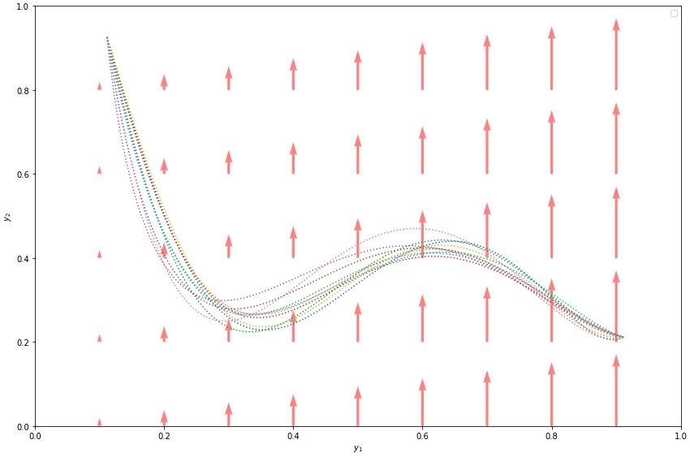

*******
Pyrotor
*******

*Python Route Trajectory Optimiser*

PyRotor is a Python library for trajectory optimisation problems which leverages available trajectory data to get realistic trajectories.

It has been created and developed by members of the `MODAL <https://team.inria.fr/modal/>`__ team from `Inria <https://www.inria.fr>`__.

.. toctree::
   getting_started/index
   api/index
   core_modules/index
